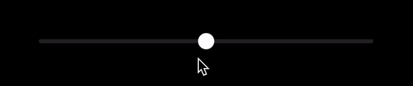
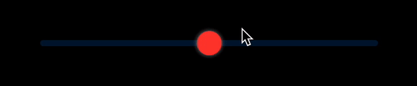
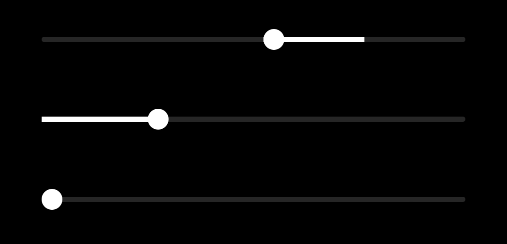

# CustomOriginSlider 

CustomOriginSlider is an open-source SwiftUI package that provides a customizable origin slider for your iOS projects. This slider allows users to select values in a range, either negative or positive, from an origin point.

This package provides a variety of customization options such as thumb size, color, guide bar style, tracking bar color, and more, making it a flexible choice for your user interface needs.

## Features

- Set the minimum and maximum values for your slider.
- Set the defaultValue value for set the center of your slider.
- Customize the slider's thumb size, color, and shadow.
- Style the guide bar with your choice of corner radius, color, and height.
- Define the appearance of the tracking bar, including its color and height.

## Requirements

- iOS 14.0+
- mac OS 11.0+

## Installation

CustomOriginSlider is available through the Swift Package Manager. 

To add CustomOriginSlider to your Xcode project:
1. Select File > New > Package...
2. Enter `https://github.com/laszlotuss/CustomOriginSlider.git` into the package repository URL text box.
3. Follow the prompts to add the package to your project.

## Usage

First, import the `CustomOriginSlider` package in the file where you want to use it:

```swift
import SwiftUI
import CustomOriginSlider
```

```
struct ContentView: View {
    @State private var sliderValue: Float = 0.0

    var body: some View {
        CustomOriginSlider(
            minValue: -100,
            maxValue: 100,
            sliderValue: $sliderValue
        )
    }
}
```

In this example, the slider's value can vary from -100 to 100, starting from 0. The aims to look as native as possible when no customization is added.

To further customize the slider, you can specify other properties as per your needs. For example:

```
CustomOriginSlider(
    minValue: -50,
    maxValue: 50,
    defaultValue: 15,
    sliderValue: $value2,
    thumbSize: 24,
    thumbColor: .red,
    guideBarCornerRadius: 4,
    guideBarColor: .blue.opacity(0.2),
    guideBarHeight: 6,
    trackingBarColor: .blue,
    trackingBarHeight: 6,
    shadow: 2,
    shadowColor: .gray,
    backgroundColor: .clear
)
```


The last example shows three slider with custom origin and the **sliderValue** of **25**. Note if the **defaultValue** is not set, it's either will be **0** or the closes value inside your **minValue** to **maxValue** interval.

```
CustomOriginSlider(
	minValue: -30,
	maxValue: 75,
	defaultValue: 50,
	sliderValue: $value)
                
CustomOriginSlider(
	minValue: 0,
	maxValue: 100,
	sliderValue: $value)
                
CustomOriginSlider(
	minValue: 50,
	maxValue: 100,
	sliderValue: $value)
```


## Contribution
Contributions to the CustomOriginSlider project are welcome! Feel free to open a new issue or send a pull request, if you happen to find a bug, or would liek to add any new features.

## License
CustomOriginSlider is available under the MIT license.
